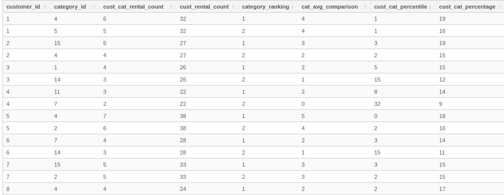
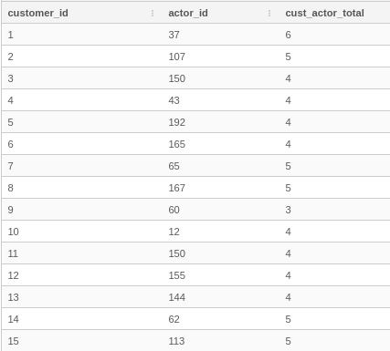
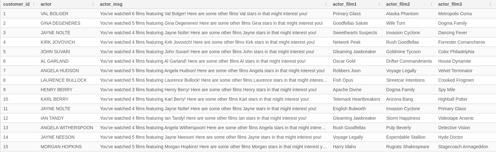
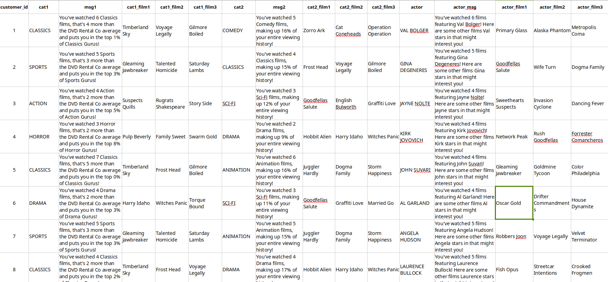

<h1 style="text-align: center;"> Marketing Analytics Case Study</h1>

<h2 style="text-align: center;">1. 📚️ Introduction </h2>

This Case Study focuses on leveraging SQL to prepare data for a marketing campaign and derive actionable insights. The goal is to help a DVD rental business engage customers on an individual level, based on their past behavior.

### 1.1 🗝️ Key Features

- **Data Exploration**: Analyze customer demographics, rent patterns, and engagement metrics.
- **Communication**: Prepare data for email to present insights effectively.


### 1.2 🎯️ Outcomes

- Improved understanding of customer behavior.
- Customised marketing emails based on data insights.
- Optimized campaign performance and ROI.

### 1.3 Requirements Analysis

The DVD Rental Co marketing department has requested for help getting the data needed to fuel their first ever customer email campaign. They shared a template of the email they will send to each customer and after analysing it, we have a broad idea of what data we need to provide. We have split these main requirements into 9 major insights, for each customer.

<div style="text-align: center;">


</div>

The table below summarises our observations on each insight.

| Insight | Description   | Remark     |
| --------| --------------------------------------- | ----------- |
| 1 and 4 | Top (most watched) 2 categories.     |   -         |
| 2 and 5 | Some statistics based on the categories identified in (1) & (4) | - |
| 3 and 6 | Film recommendations based on the categories identified in (1) & (4) | - The recommended films should not have been watched by the customer.<br>- Flag customer if no recommendation for either (3) or (6) |
| 7 | Favourite actor | Choose in alphabetic order if there are ties  |
| 8 | Some statistics related to the favourite actor identified in (7) | - |
| 9 | Film recommendations based on the favourite actor identified in (7) | - No film in (3) or (6) should be found here.<br>- Flag customer if there's no film recommendation|
 
 <h2 style="text-align: center;"> 2. ℹ️ The Data </h2>

The data for this project is available in the DVD Rental Co database and the tables needed are shown in the entity relationship diagram (ERD) below.

<div style="text-align: center;">


</div>

We observe that all these tables are linked by foreign keys, though not directly. To decide what type of joins to use to link our tables, we start by thinking about the data practically:

| Tables  | Purpose of Join | Points to Consider | Things to verify | Preferred Join |
| --------| ----------------| ------------------ | ---------- | ---------- |
| 1 and 2 | These two tables need to be joined because from the ERD, we see that the only way of associating a rental to a film is via the inventory table and we need to know which films were rented. | - Every rental operation (in table 1) has to be based on an inventory item (in table 2). So, an entry in table 1 without a matching inventory in table 2 must be an accident and we can't use that data without correcting it. Hence a left join won't be appropriate.<br>- An inventory not rented is not useful for our analysis so we don't need any record in table 2 that has no corresponding record in table 1. Hence we can't use a right join. | | Inner join |
| 2 and 3 | We need to join the inventory table to films so that we can know the titles of the films that were rented. |- Every inventory record (in table 2) should correspond to a film (in table 3). So an inventory record not associated to a film could only be an error, making it useless for any analysis. As a result, we can't use a left join.<br>- A film cannot be rented without a corresponding inventory record so a record in table 3 with no matching entry in table 2 is not helpful to our analysis This means a right join isn't an option here. | | Inner join    |
| 3 and 4 | To provide insights 1 and 4 from our requirements analysis ([Section 1.3](#13-requirements-analysis)), we need to know the category each film falls in. | - Practically, a film could belong to more than one category.<br>- A film without a category won't be useful in this join. This implies that we can't use a left join here.<br>- A category without films can't provide information for our insight hence it wouldn't be useful. This means we can't use a right join. | - Are there films which fall in more than one category? | Inner join    |
| 4 and 5 | This join is necessary to get the category names. | - An entry in table 4 with no corresponding entry in table 5 will be a nameless category, something we can't use in our campaign. Hence a left join can't be used here.<br>- An entry in table 5 without a corresponding entry in table 4 cannot be associated to a film, making it useless for our analysis. So, we can't use a right join here. | | Inner join    |
| 3 and 6 | To provide insights 7, 8 and 9 from our requirements analysis ([Section 1.3](#13-requirements-analysis)), we need to know the actors who feature in each film. | - A film with no recorded actors won't be useful in this join. This implies that we can't use a left join here.<br>- An actor who doesn't feature in any film can't be used in our insights. This means we can't use a right join. | | Inner join    |
| 6 and 7 | This join is necessary to get the names of actors. | - An entry in table 6 with no corresponding entry in table 7 represents an actor with no name, something we can't use in our campaign. Hence a left join can't be used here.<br>- An entry in table 7 without a corresponding entry in table 6 cannot be associated to a film, making it useless for our analysis. So, we can't use a right join here. | | Inner join    |

We run an sql query to verify if any films fall in more than one category.
```sql
SELECT
  film_id,
  COUNT(*) categories
FROM dvd_rentals.film_category
GROUP BY film_id
HAVING COUNT(*) > 1;
```


With no film in more than one category, we need not be concerned about double counting.

<h2 style="text-align: center;"> 3. 🤔️ Solution </h2>

### 3.1 Strategy

**Generally, to minimize compute operations and memory usage, we perform joins and add columns to our queries only when needed.**

Given our problem and the data, our strategy for getting the required information for each customer is outlined in the table.

| Id | Insights | Plan | Tables involved | Expected results |
|----|----------|------|-----------------|------------------|
| a  | 1, 2, 4 and 5  | - Identify the 2 most watched categories.<br> Calculate:<br>- number of films customer watched in category 1 and category 2<br>- number of films customer watched in category 1, compared to the average number of films each customer watched in same category<br>- percentile customer falls in when compared to other viewers of category 1<br>- number of films watched in category 2 compared with total number of films watched by the customer. | - rental<br>- inventory<br>- film<br>- film_category | - Category 1<br>- Category 2<br> - cust_cat_rental_count<br>- cat_avg_comparison<br>- cust_cat_percentile<br>- cust_cat_percentage |
| b  | 3 and 6 | Make 3 film recommendations based on category 1 and 3 film recommendations based on category 2 | Temp tables from (a) + category | - cat1_film1<br>- cat1_film2<br>- cat1_film3<br>-- cat2_film1<br>- cat2_film2<br>- cat2_film3 |
| c  | 7 | Identify customer's favourite actor | - rental<br>- inventory<br>- film_actor<br>- actor | - fav_actor |
| d  | 8 and 9 | - Count the number of films customer watched, featuring fav_actor.<br>- Make 3 film recommendations based on fav_actor | Temp tables from (c) |  - actor_film_count<br>- actor_film1<br>- actor_film2<br>- actor_film3 |

### 3.2 Code

The complete SQL code used in this step can be found in the script [here](marketing.sql)
#### a. Identify the 2 most watched categories and get statistics on them

1. Create *joint_tables* to consolidate the data needed to associate film categories with customers via rentals. Also get the number of films customer watched in each category (cust_cat_rental_count)
2. Create *distinct_cust_table* to remove duplicates from *joint_tables*.
3.  Use *joint_tables* to create *ranked_cust_categories* which identifies the top two categories for each customer. . While at it, compute:
    - number of films customer watched in category, compared to the average number of films each customer watched in same category (cat_avg_comparison)
    - percentile customer falls in when compared to other viewers of same category (cust_cat_percentile)
    - number of films watched in category compared with total number of films watched by the customer (cust_cat_percentage).
  
When we run a simple query to see the records in the ranked_cust_categories table, we get the below.

```sql
SELECT * FROM ranked_cust_categories
LIMIT 15;
```



#### b. Movie recommendations based on Category 1 and Category 2

1. Create *cust_watched_films* to store the list of films watched by each customer. This is used to filter out films that have already been watched when generating recommendations.
2. Create *film_cat_ranking* to identify the most watched films in each category. Use the latest rental date to sort if there's a tie on the number of views.
3. Select the top 3 recommendations for each customer's top 2 categories, filtering out the films they have already watched. We include a message for each recommendation that provides context on the customer's viewing habits. It is best to do this at this point so that we don't have to query the *ranked_customer_categories* table again, down the line.
4. Create *cust_cat_recommendations* to summarize the recommendations so there's only one record per customer.

We run a simple query to see what we have so far ...
```sql  
  SELECT * FROM cust_cat_recommendations
  ORDER BY customer_id
  LIMIT 15;
```


#### c. Identify each customer's favourite (most watched) actor

1. Create *actor_stats* to consolidate the data needed to associate actors with customers via rentals
2. Identify each customer's favourite actor, ranking the actors by number of films watched, then first and last name to get rid of any ties.

We run a simple query to see each customer's favourite actor
```sql  
  SELECT * FROM cust_fave_actor
  ORDER BY customer_id
  LIMIT 15;
```


#### d. Film recommendations based on customer's favourite actor

1. Use *actor_stats* to create *film_actor_ranking* that identifes the most watched films for each actor. Rank the films by number of views, then latest rental date to get rid of any ties.
2. Create *actor_recommendations* to identify the top 3 recommendations for each customer's favourite actor, filtering out the films they have already watched and those that have already been recommended.

3. Create *cust_actor_recommendations* to summarize the recommendations so there's only one record per customer. Also include a message for each recommendation that provides context on the customer's viewing habits.

We query the *cust_actor_recommendations* table to see what the recommendations look like.
```sql
SELECT * FROM cust_actor_recommendations
ORDER BY customer_id
LIMIT 15;
```


<h2 style="text-align: center;"> 4. 💡️ Final Output </h2>

We consolidate the category and actor recommendations to come up with the final data for the marketing campaign.
```sql
SELECT * FROM recommendations
ORDER BY customer_id
LIMIT 15;
```



With this data, we can easily generate emails for the email campaign. For example, for the customer with customer_id = 1, the email will look this:
> ## DVD RENTAL CO
>*Personalized recommendations from our very own team of film afficionados!*
> ### CLASSICS
> You've watched 6 Classics films, that's 4 more than the DVD Rental Co average and puts you in the top 1% of Classics Gurus!<br><br>
> Your expertly chosen recommendations:
> 1. Timberland Sky
> 2. Voyage Legally
> 3. Gilmore Boiled
> ### COMEDY
> You've watched 5 Comedy films, making up 16% of your entire viewing history!<br><br>
> Your hand-picked recommendations:
> 1. Zorro Ark
> 2. Cat Coneheads
> 3. Operation Operation
> ### VAL BOLGER
> You've watched 6 films featuring Val Bolger! Here are some other films Val stars in that might interest you!
> 1. Primary Glass
> 2. Alaska Phantom
> 3. Metropolis Coma <br>
> ** **