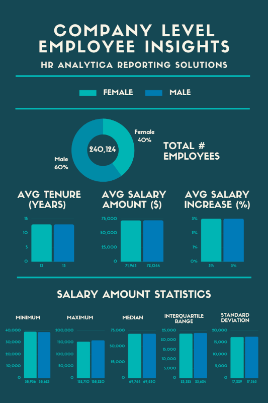
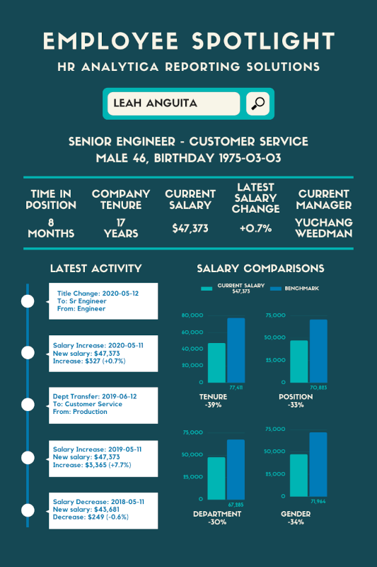

<h1 style="text-align: center;"> People Analytics Case Study</h1>

<h2 style="text-align: center;"> 1. 📚️ Introduction </h2>

This Case Study focuses on leveraging SQL to prepare data for a people analytics dashboard. The goal is to help an HR department build a bespoke dashboard and employee view ("Deep dive") page.

### 1.1 🗝️ Key Features

- **Employee Demographics Analysis**: Understand workforce composition by analyzing age, gender, tenure, and other demographic factors.
- **Resource Allocation**: Optimize workforce planning and resource distribution based on data-driven insights.
- **Diversity and Inclusion**: Monitor and promote diversity and inclusion initiatives within the organization.
- **Recruitment Optimization**: Analyze hiring trends and improve recruitment strategies for better talent acquisition.
- **Performance Metrics**: Evaluate employee performance trends and their impact on organizational goals.
- **Training and Development**: Identify skill gaps and recommend targeted training programs to enhance employee growth.
- **Attrition and Retention Insights**: Identify patterns and predictors of employee turnover to improve retention strategies.

### 1.2 🎯️ Outcomes

- Enhanced understanding of workforce trends and employee behavior.
- Data-driven decision-making for talent management and retention.
- Optimization of HR processes and resource allocation.
- Support for strategic planning and organizational development.
- Identification of skill gaps and training needs.
- Increased efficiency in recruitment and onboarding processes.

### 1.3 Requirements Analysis

HR Analytica has requested for datasets to answer some reporting questions and feed their dashboards.

#### 1.3.1 Reporting Statistics needed

The statistics needed are: 
**A. Company Level Insights**
1. Total number of employees
2. Average company tenure in years
3. Gender ratios
4. Average payrise percentage and amount

**B. Department Level Insights**
1. Number of employees in each department
2. Current department manager tenure in years
3. Gender ratios
4. Average payrise percentage and amount

**C. Title Level Insights**
1. Number of employees with each title
2. Minimum, average, standard deviation of salaries
3. Average total company tenure
4. Gender ratios
5. Average payrise percentage and amount

**D. Individual Employee Deep Dive**
1. See all the various employment history ordered by effective date including salary, department, manager and title changes
2. Calculate previous historic payrise percentages and value changes
3. Calculate the previous position and department history in months with start and end dates
4. Compare an employee’s current salary, total company tenure, department, position and gender to the average benchmarks for their current position

#### 1.3.2 The Dashboards

HR Analytica has provided samples of the two main dashboards to be constructed.
1. The People Analytics Dashboard

2. The Employee Deep Dive Dashboard

 
<h2 style="text-align: center;"> 2. ℹ️ The Data </h2>

<h2 style="text-align: center;"> 3. 🤔️ Solution </h2>

### 3.1 Strategy

**Generally, to minimize compute operations and memory usage, we perform joins and add columns to our queries only when needed.**

### 3.2 Code

The complete SQL code used in this step can be found in the script [here](people.sql)

<h2 style="text-align: center;"> 4. 💡️ Final Output </h2>
