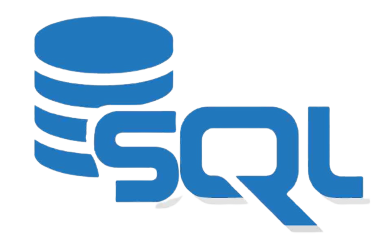

# Serious SQL Projects

## 📚️ Introduction

This repository contains solutions to the case studies in the [Serious SQL course](https://www.datawithdanny.com/courses/serious-sql) at *Data with Danny*.

The main objective of these projects is to display the use of SQL and critical thinking in tackling everyday business concerns.

Table of Contents
- [Marketing Analytics](Marketing_Analytics/README.md)

## The Data Used

##### The databases are proprietary to *Data with Danny* so there is no code/script for creating them, here.
 
 *Data with Danny* provides it's data via a development environment composed of a postgres database server (on which the databaes are already created and populated) and an SQLPad GUI for accessing and querying the databases. This environment can be accessed in two ways:
 1. deploying the serious-sql-environment github repository on gitpod.
 2. deploying the serious-sql-environment container locally on Docker.

## 🛠️ Tools and Technologies Used

- **SQL**: For querying and transforming data.
- **Database**: Relational databases (PostgreSQL).
The use of containers for setting up the databases ensures that these projects are entirely focused on (postgres) SQL

## Repo Structure

Each case study or challenge has its own folder with a `README.md` that explains what it is about and how it was handled.
